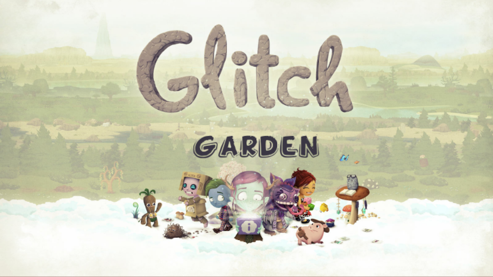
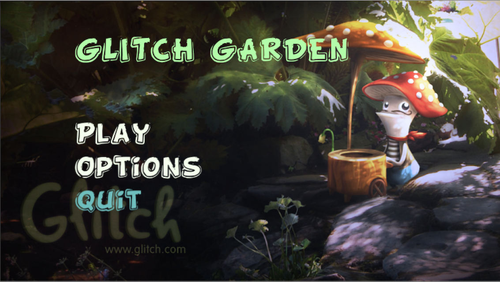
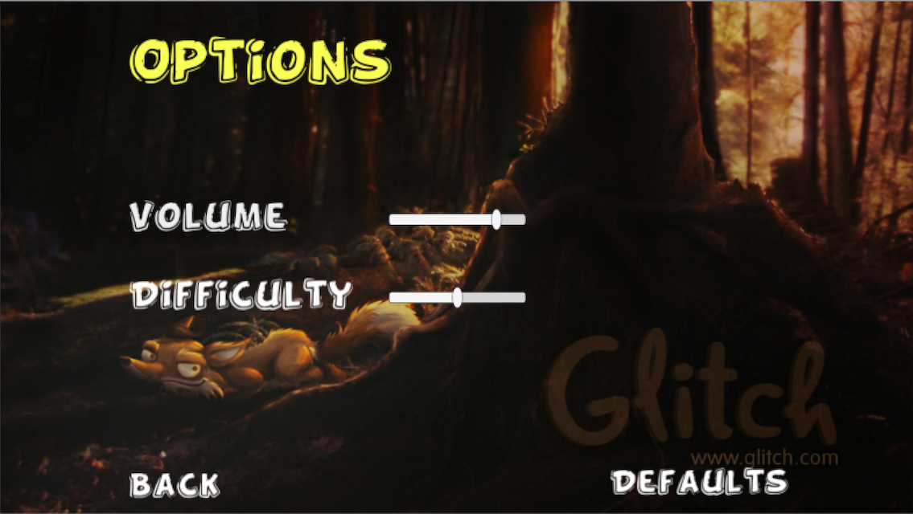
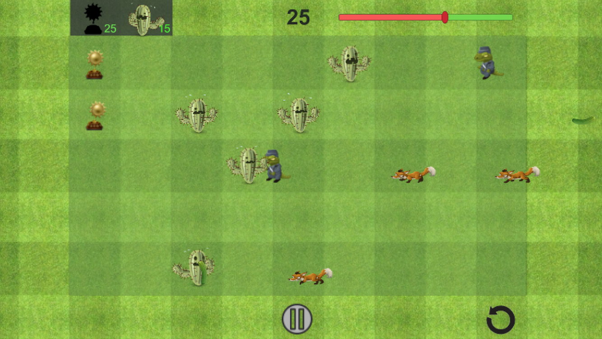
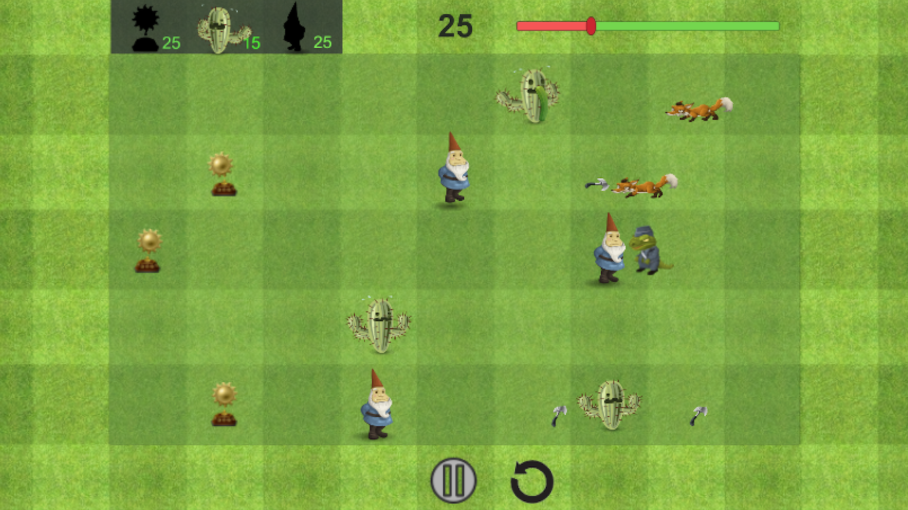
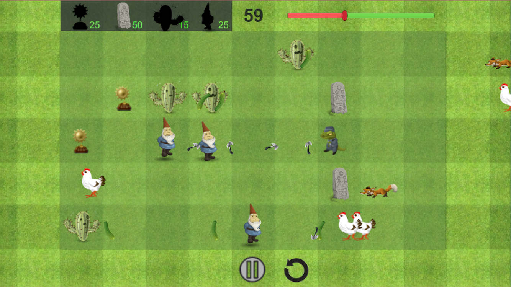
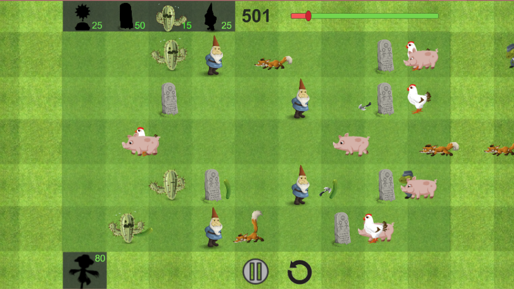
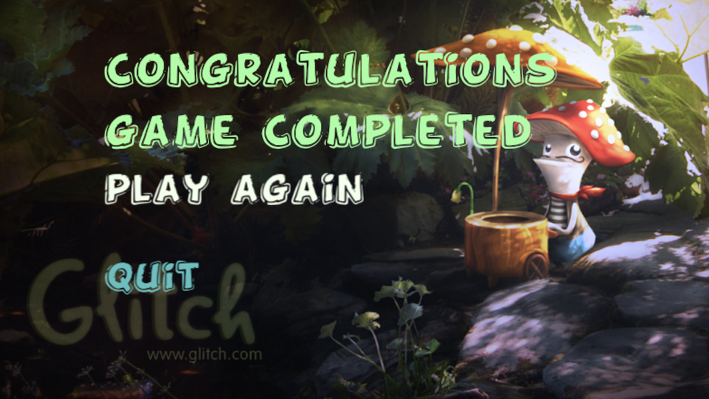
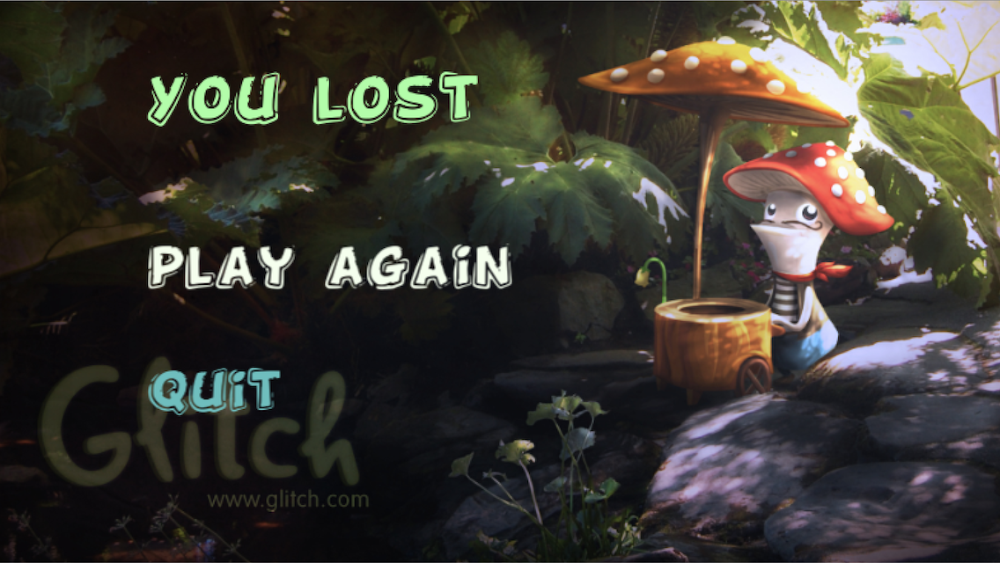

#Glitch Garden
Attackers are attacking defend the arena by spawning the defenders.
Game available for downloading at

##Scripting Classes
<b>Attacker.cs</b> - Controlles all the Attackers, Parent class of all the Attackers. (Lizard, Fox, Chicken, Piggy).

<b>Button.cs</b> - Responsible for taking the user from the user, as game is for touch screen mobile phones as well as Computers so the input is taken by the tap of user that tap is read by this Class.

<b>Chicken.cs</b> - Manages the functionality of Chicken.

<b>Defender.cs</b> - Controlles all the Defenders, Parent class of all the Defenders. (Tryphy, Cactus, Gnome, Grave Stome, Scarecrow).

<b>DefenderSpawner.cs</b> - When user taps in the game for Spawning the Defenders for defending the functionality of Spawn of Defenders is managed by this Class.

<b>FadeIn.cs</b> - For Fade in Effet on the loading of Scene.

<b>Fox.cs</b> - Manages the functionality of Fox.

<b>GameMask.cs</b> - When user play the game for first time introductory overlay appears that overlay is managed by this Class.

<b>GameTimer.cs</b> - Scene timeout for winning a level is managed by this class.

<b>Health.cs</b> - Health of both Attackers and Defenders is Managed by this class.

<b>LevelManager.cs</b> - This class is having functions for making the transition easy from on scene to another.

<b>Lizard.cs</b> - Manages the functionality of Lizard.

<b>Loose.cs</b> - Conditions for loosing the game are defined in this class.

<b>MusicManager.cs</b> - Class for managing music during the scenes, having capabilities to keep music playing during the switch of scene.

<b>OptionsController.cs</b> - Manages Options, This class is managing all the functionality of Options Scene.

<b>Pause.cs</b> - Manages pause and Resume during the game play.

<b>Piggy.cs</b> - Manages the functionality of Piggy.

<b>PlayerPrefsManager.cs</b> - Manages Data stored in PlayerPrefs.

<b>Projectile.cs</b> - Controls all the projectiles like speed of projectils, damage done by an individual projectile etc.

<b>ReloadLevel.cs</b> - Reloads the level.

<b>Shedder.cs</b> -  Used for destroying the projectiles and Attackers which paas from the game arena.

<b>Shooter.cs</b> - Controls the instantiation of projectiles.

<b>Spawner.cs</b> - Used for instantiation of Attackers.

<b>StarDisplay.cs</b> - used for counting the number of Stars(currency in context of game). This class counts the number of stars generated by Tropy and detects when a defender is Spawned.

<b>Stone.cs</b> - Manages the functionality of GraveStone.

##Scenes (<i>in order</i>)

###Splash Screen

###Start Screen

###Options Screen

###Level 1

###Level 2

###Level 3

###Level 4

###Loose Screen

###Win Screen

